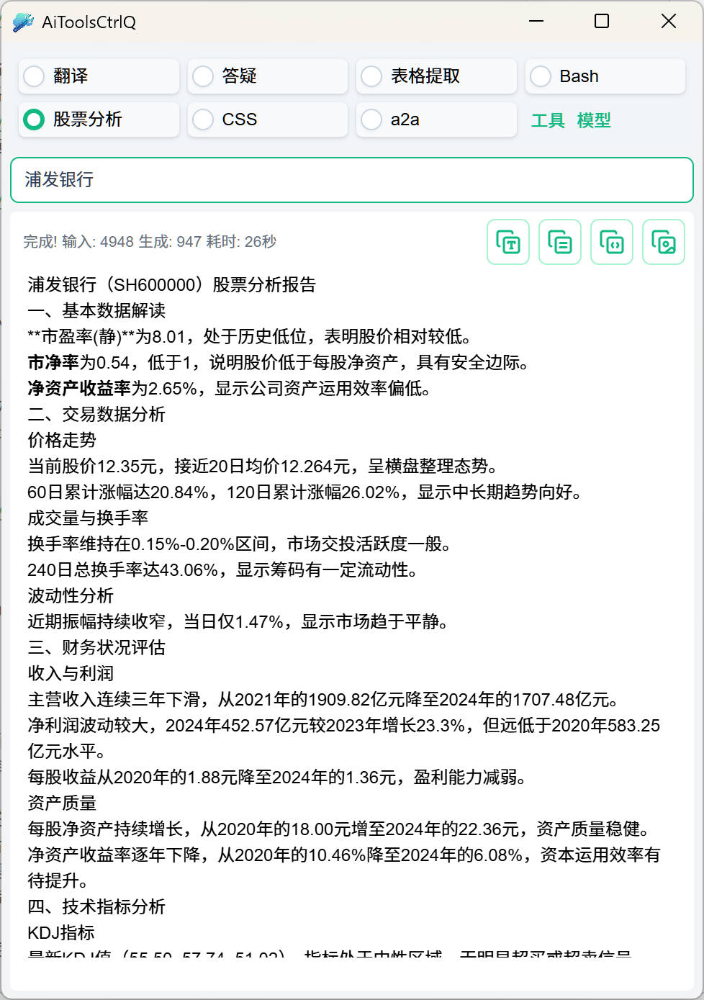

# 功能

现在有很多基于大模型API的客户端可用, 它们大多数需要你切换到它的界面, 然后在输入框输入或是复制粘贴内容, 发送请求, 等待结果返回, 然后再切换回你原来的软件中.
而 `AiToolsCtrlQ` 则是一个更为方便的工具, 它允许你在任何软件中, 选中一些内容, 按下 `Ctrl+Q`, 就可以将选中的内容发送给大模型, `AiToolsCtrlQ` 设计为小窗模式, 便于你在使用其他软件时, 也能随时查看模型的返回结果, 而不会打断你当前的工作.

同时, `AiToolsCtrlQ` 不保留上下文, 而且将每次请求都视为独立的请求, 所以它适合诸如 `翻译`, `答疑`, `表格提取` 等一次性的使用场景.

例如:

- 在 `calibre` 电子书阅读器中, 选中一段文字, 按下 `Ctrl+Q`, 发送`翻译`请求, 让模型翻译选中的文字.

- 对一个包含表格的图片, 复制图片后, 按下 `Ctrl+Q`, 发送`表格提取`请求, 让模型将图片中的表格提取出来, 以便在电子表格中使用.

- 在任何支持选中复制的软件中, 选中一些内容, 按下 `Ctrl+Q`, 发送`答疑`请求, 让模型回答你对选中内容的进行解释.

## MCP 支持

`AiToolsCtrlQ` 支持 `MCP` 的 `Prompts` 和 `Tools` 功能，但仅支持通过 `HTTP` 的MCP服务, 不支持 `STDIO` 访问 `MCP`

- `Prompts` 功能, 如果 `MCP` 提供了 `Prompts` 功能, 在配置时会列出所有可用的 `Prompts`, 你可以选择一个作为默认的 `Prompt`
- `Tools` 功能, 如果 `MCP` 提供了 `Tools` 功能, 在使用时, 这些功能会由模型自动选择是否使用.

# 使用方式

在任何支持选中复制的软件中, 选中一些内容, 按下 `Ctrl+Q`, 发送请求, 让模型处理选中的内容.

## 工具配置

在 `AiToolsCtrlQ` 中, 你可以配置多个工具, 点击 `工具` 按钮, 进入工具配置界面, 你可以在这里添加, 删除, 编辑工具. 其中

- 系统提词: 描述了工具的功能, 它会作为模型的系统提示词, 以便模型执行制定的任务.
- 后置处理：选择当模型返回结果后, 是否需要对结果进行后置处理
  - `无`：不进行后置处理, 显示模型返回的原始结果
  - `复制`：将模型返回的结果复制到剪贴板, 对于诸如翻译文章，编写代码等场景, 可以做到不离开当前软件, 通过 `Ctrl+Q` 发送，然后 `Ctrl+V` 粘贴到当前软件中.
  - `保存`：将模型返回的结果保存到文件中, 对于批量识别图片、摘要等场景, 可以在资源管理器中选中一些文件，
    按下 `Ctrl+Q`, 模型会逐个处理选中的文件, 并将结果保存到同一目录下 `JSON/Markdown/HTML` 文件中, 以便后续查看.

每个工具实际是限定了系统提词的的配置, 在其他的软件中, 一般也称为`智能体`.

## 模型配置

在 `AiToolsCtrlQ` 中, 点击 `模型` 按钮, 进入模型配置界面, 仅支持兼容 `OpenAI` 的模型, 但你可用通过 [LLMGateway](https://github.com/elsejj/llm-gateway/tree/keystore) 来使用其他模型.

如果要模型处理图片, 请设置为支持多模态的模型, 或者设置一个备选的视觉模型, 但一般来说, 纯视觉模型的效果不如多模态模型.

